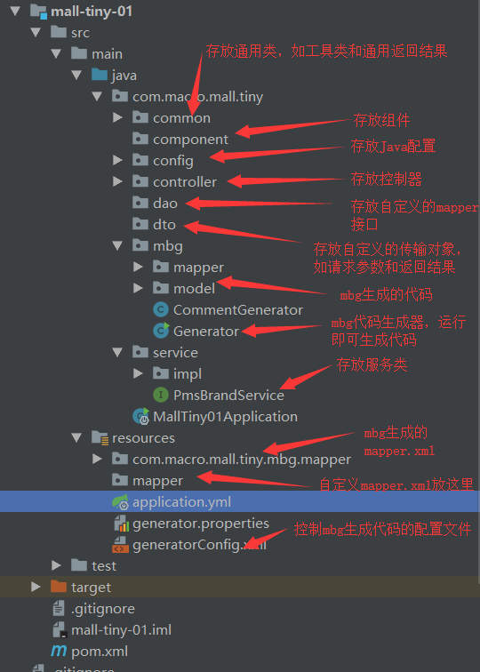

# mall-learning

[mall整合Spring官网](https://www.macrozheng.com/mall/architect/mall_arch_01.html#mysql%E6%95%B0%E6%8D%AE%E5%BA%93%E7%8E%AF%E5%A2%83%E6%90%AD%E5%BB%BA)

## 整合redis实现缓存功能

## 整个Kafka实现订阅功能

1. 启动SpringBoot
2. 服务器启动消费者, /ykyy/kafka/bin/kafka-topics.sh --bootstrap-server 192.168.0.46:9092 --topic test --from-beginning

## 问题记录

### 实体类不要首字母大写

[参考链接](https://blog.csdn.net/qq_24155097/article/details/107034023)

- Spring默认的命名方式, 首字母转小写, 练习大写字母转成小写
- 建议参数类型都: 小写字母, 以下划线分隔. eg: spring_boot

> 实体类参数大写, 可能会导致接收不到参数数据. 导致空指针异常
